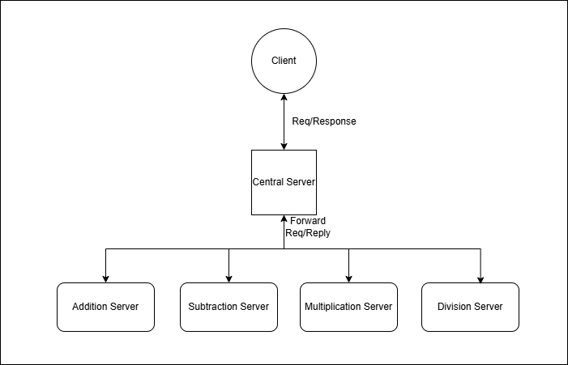

# Distributed Calculator Service Task

### Problem Statement:

Design a distributed calculator service using a client-server model hosted on Docker. The system should include:

1. **Client**: Sends arithmetic operation requests (add, subtract, multiply, divide) to the central server.
2. **Central Server**: Routes requests to appropriate arithmetic services and returns responses to the client.
3. **Arithmetic Services**: Add, Subtract, Multiply, and Divide services, each hosted in separate Docker containers.

### Requirements:

- Containerize all components using Docker.
- Enable communication between components (e.g., HTTP).
- Handle errors like invalid inputs and division by zero.
- Provide scalability and maintain logs at the central server.

### Outcome:

A functional and containerized calculator service with example client interactions.

## Reference Image


### Probable Project Structure

```plaintext
distributed-calculator-service/
├── client/
│   ├── Dockerfile
│   └── app.py
├── central_server/
│   ├── Dockerfile
│   └── app.py
├── add_service/
│   ├── Dockerfile
│   └── app.py
├── subtract_service/
│   ├── Dockerfile
│   └── app.py
├── multiply_service/
│   ├── Dockerfile
│   └── app.py
├── divide_service/
│   ├── Dockerfile
│   └── app.py
├── docker-compose.yml
└── README.md
```

### Example Client Interaction
The client should provide a menu to send arithmetic operation requests to the central server. The central server should route these requests to the appropriate arithmetic service and return the results to the client.

- Menu:
  - 1. Add
  - 2. Subtract
  - 3. Multiply
  - 4. Divide
  - 5. Exit
  - Enter choice: 1
  - Enter two numbers: 10 20
  - Result: 30
- Menu:
  - 1. Add
  - 2. Subtract
  - 3. Multiply
  - 4. Divide
  - 5. Exit
  - Enter choice: 4
  - Enter two numbers: 10 0
  - Error: Division by zero
  - Menu:
    - 1. Add
    - 2. Subtract
    - 3. Multiply
    - 4. Divide
    - 5. Exit
    - Enter choice: 5
    - Exiting...


